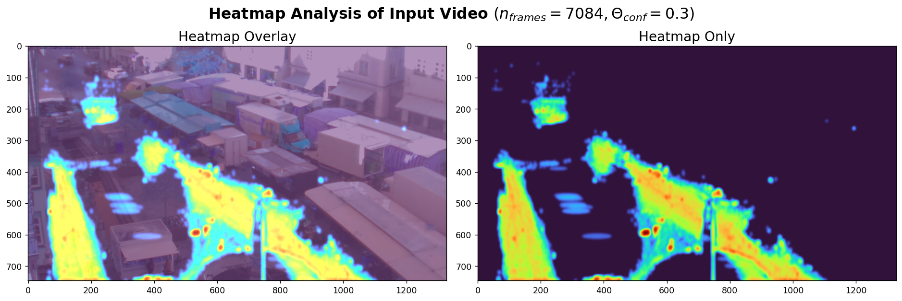

# Hackathon: Heilbronn Future City 🚀

Team Members:
- Sebastian E.
- Marius A.
- Jonathan M.
- Nathan H.
- Morris O.
- Alessio N.

# About the Project 
TBD

# Set up Environment 👨🏽‍
**Python Version**: 3.11.0

1. Clone the repository by running the following command in your terminal:

   ```
   git clone https://github.com/MorrisOh/Hackathon2023
   cd Hackathon2023
   ```


2. [Optional] Create a virtual environment and activate it. For example, using the built-in `venv` module in Python:
   ```
   python -m venv venv
   source venv/bin/activate
   ```

3. Install the required packages by running the following command in your terminal:

   ```
   pip install -r requirements.txt
   ```
4. Run pipeline via:

   ```
   python main.py --path "data/raw/test_video.mov" --k 12 --conf 0.3
   ```
where ...
- `--path` is the path to the input video to test / create the heatmap.
- `--k` is the k-th frame to consider for inference, e.g. every 10 frame.
- `--conf` is the confidence threshold for classification.  

To lower the amount of computation power, consider a high k, e.g. k=24.


# Examples 

